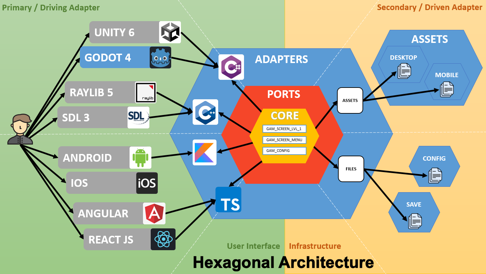

# 2D Game Starter - Multi Engine (Android, Angular, React, Unity, Godot, SDL, Raylib)

[](https://opensource.org/licenses/MIT)
[](https://twitter.com/Damien_Fremont)
[](https://www.buymeacoffee.com/damienfremont)

:warning: **WORK IN PROGRESS !!!**


I made the same game in 8 engines !

Spoiler: Don't do it !!! Unless you intend to build your own custom engine in the futur, or be able to maintain your code in 20+ years.

Pros & Cons:
- less dependency to engine
- too much complexity

## Content

  - [Dependencies](#dependencies)
  - [Screenshots](#screenshots)
  - [Features](#features)
  - [Install](#install)
  - [Usage](#usage)
  - [Assets](#assets)
  - [Resources](#resources)

---------------------------------------

## Dependencies

- C++ 2020 / C 2017

## Screenshots



## Features

- Engine
  - [ ] Godot (4.7)
  - [ ] Unity (6.0.1)
  - [ ] Android
  - [ ] Raylib (5.0)
- Features
  - [ ] 2D
  - [ ] Audio
    - [ ] Sound effects
    - [ ] Music
  - [ ] UI
    - [ ] Main Menu
    - [ ] Settings Menu

Repository layout:
```
├── assets
├── docs
├── infra
├── lib
├── platform
│   ├── assets
│   └── core
├── standalone
│   ├── android
│   ├── unity
│   └── ...
└── tools
    └── ci
```

## Install

```bash
.\tools\ci\clean.bat
```

## Usage

```bash
.\tools\ci\dev.bat
```

## Release

```bash
.\tools\ci\release.bat
```
